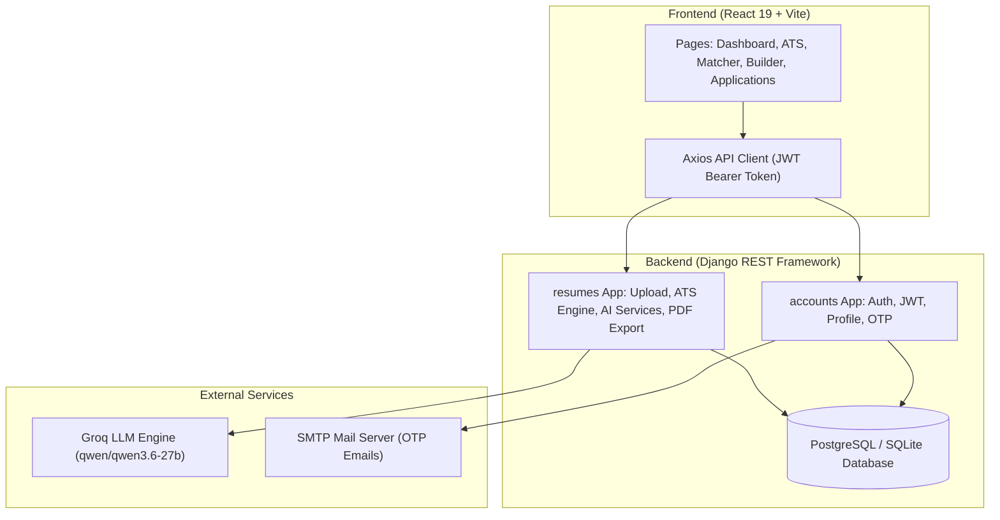

# 📄 Resume Tracker System

An end-to-end, AI-powered **Resume Tracker & ATS Optimization System** built with **Django REST Framework (Python)**, **React 19 (Vite + Tailwind CSS)**, and **Groq Cloud AI**.

The system enables job seekers to upload resumes, extract text, run ATS checks, optimize resume content against target Job Descriptions, manage job application pipelines, and export professional PDF resumes.

---

## 🚀 Quick Start (1-Command Setup)

### 1. Prerequisites
- **Python 3.10+**
- **Node.js 18+** & `npm`
- **Groq API Key** (Get free key at [console.groq.com](https://console.groq.com/))

### 2. Environment Setup
Copy `.env.example` to `backend/.env` and update your settings:
```bash
cp .env.example backend/.env
```

Ensure `backend/.env` contains your Groq API key:
```env
SECRET_KEY=change_this_secret_key
GROQ_API_KEY=gsk_your_groq_api_key_here
GROQ_MODEL=qwen/qwen3.6-27b
```

### 3. Run Development Servers
From the root directory, execute:
```bash
npm run dev
```
This single command concurrently launches both servers:
- **Frontend App**: `http://localhost:5173/`
- **Backend API**: `http://127.0.0.1:8000/`

---

## 🏗️ System Architecture



---

## ✨ Features Overview

| Module | Feature Description | Tech Stack / Tool |
| :--- | :--- | :--- |
| **Authentication** | User registration, JWT login, profile picture management, OTP password reset | Django REST, SimpleJWT |
| **Resume Extraction** | Upload PDF resumes & extract text cleanly without word merging | PyMuPDF (`fitz`) |
| **ATS Evaluation** | Rule-based scoring (0-100) analyzing keywords, skills, sections & contact details | Local ATS Engine & Groq |
| **AI Resume Review** | Summary, strengths, weaknesses, missing skills & improvement tips | Groq LLM API |
| **Job Description Matcher**| Compare resume vs job description for match score % & keyword gaps | Groq LLM API |
| **AI Resume Rewriter** | Optimize resume content tailored to job description without fake experience | Groq LLM API |
| **AI Cover Letter** | Generate professional cover letters customized for target jobs | Groq LLM API |
| **Interview Questions** | Generate 10 technical, 5 HR, and 5 project interview questions | Groq LLM API |
| **Application Pipeline**| Track job application status (`APPLIED`, `INTERVIEWING`, `OFFER`, etc.) | Django Models & REST API |
| **Resume Builder** | Interactive form storing structured JSON & downloading styled PDFs | ReportLab |
| **Dashboard Analytics** | Visual stats, total analyses, score trends over time & recent activity | Django DB & Charting UI |

---

## 📡 API Endpoint Reference

### Authentication (`/api/accounts/`)
- `POST /api/accounts/register/` - Register new candidate account
- `POST /api/accounts/login/` - Login & return JWT access + refresh tokens
- `GET/PATCH /api/accounts/profile/` - Retrieve or update user profile
- `POST /api/accounts/send-otp/` - Send password reset verification code
- `POST /api/accounts/verify-otp/` - Verify OTP code
- `POST /api/accounts/reset-password/` - Reset password using verified OTP

### Resumes & AI (`/api/resumes/`)
- `GET /api/resumes/` - List user uploaded resumes
- `POST /api/resumes/upload/` - Upload PDF resume & extract text
- `GET /api/resumes/<id>/ats/` - Evaluate ATS score for resume ID
- `POST /api/resumes/ats-check-text/` - Evaluate ATS score for raw text input
- `GET /api/resumes/<id>/ai/` - Perform full AI resume review
- `POST /api/resumes/job-description/` - Create target Job Description
- `GET /api/resumes/<resume_id>/match/<job_id>/` - Match resume with job description
- `GET /api/resumes/<resume_id>/rewrite/<job_id>/` - Rewrite resume with AI
- `GET /api/resumes/<resume_id>/cover-letter/<job_id>/` - Generate cover letter
- `GET /api/resumes/<resume_id>/interview-questions/<job_id>/` - Generate interview questions
- `GET /api/resumes/dashboard-stats/` - Fetch analytics stats for dashboard

### Applications & Builder (`/api/resumes/`)
- `GET/POST /api/resumes/applications/` - List or create job applications
- `GET/PUT/DELETE /api/resumes/applications/<id>/` - Manage job application status
- `GET/POST /api/resumes/builder/` - List or create structured resume entries
- `GET /api/resumes/builder/<id>/download/` - Export resume entry as styled PDF

---

## 🛠️ Handy Management Commands

From the root directory, you can run:

```bash
# Run all Django unit tests and frontend ESLint
npm run test

# Perform Django system check and frontend production build check
npm run check

# Apply Django database migrations
npm run migrate

# Run dev servers concurrently (Backend + Frontend)
npm run dev
```

---

## 🛡️ License & Credits

Built for ATS optimization, career building, and job application tracking.
Powered by Django, React, PyMuPDF, ReportLab, and Groq Cloud AI.
